# Automyx 2.5 — Architecture (Root → Leaves)

This document describes the **complete architecture** of Automyx 2.5, from the project root directory down to every leaf module. All diagrams use **Mermaid** and render automatically on GitHub.

> 📖 The high-level user-facing README lives in [README.md](README.md). This file is for **engineers, contributors, and auditors**.

---

## 📑 Table of Contents

1. [Bird's-Eye View](#1-birds-eye-view)
2. [Project Tree (root → leaves)](#2-project-tree-root--leaves)
3. [Request Flow — From User to OS](#3-request-flow--from-user-to-os)
4. [The Multi-Task Dispatcher](#4-the-multi-task-dispatcher)
5. [The Intent Engine (NLU)](#5-the-intent-engine-nlu)
6. [The Tool Alias Explosion (9,467 names)](#6-the-tool-alias-explosion-9467-names)
7. [The Memory Subsystem (AUMFORMBRING)](#7-the-memory-subsystem-aumformbring)
8. [Deployment Topology](#8-deployment-topology)
9. [Data Flow (Streaming Chat)](#9-data-flow-streaming-chat)
10. [Module Dependency Graph](#10-module-dependency-graph)
11. [Skill Lifecycle](#11-skill-lifecycle)
12. [Error & Recovery Flow](#12-error--recovery-flow)

---

## 1. Bird's-Eye View

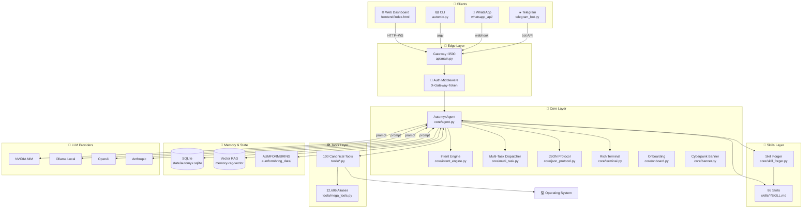

---

## 2. Project Tree (root → leaves)

```mermaid
graph LR
    ROOT[📁 AUTOMYX-2.5/]
    ROOT --> API[📁 api/]
    ROOT --> CORE[📁 core/]
    ROOT --> TOOLS[📁 tools/]
    ROOT --> SKILLS[📁 skills/]
    ROOT --> FRONT[📁 frontend/]
    ROOT --> CHAN[📁 channels/]
    ROOT --> MEM[📁 memory/]
    ROOT --> DEPLOY[📁 deploy/]
    ROOT --> CFG[📄 config files]

    API --> API1[main.py<br/>FastAPI gateway]
    API1 --> API2[40+ endpoints]

    CORE --> C1[agent.py<br/>AutomyxAgent class]
    CORE --> C2[intent_engine.py<br/>NLU + 30+ intents]
    CORE --> C3[multi_task.py<br/>parallel dispatcher]
    CORE --> C4[json_protocol.py<br/>stream filter]
    CORE --> C5[terminal.py<br/>Rich UI]
    CORE --> C6[onboard.py<br/>TUI wizard]
    CORE --> C7[onboard_pro.py<br/>advanced TUI]
    CORE --> C8[banner.py<br/>cyberpunk]
    CORE --> C9[opencode_bridge.py]
    CORE --> C10[skills.py]
    CORE --> C11[config.py]
    CORE --> C12[gateway.py]
    CORE --> C13[hardware_detector.py]

    TOOLS --> T1[pc_tools.py<br/>mouse, keyboard, files]
    TOOLS --> T2[universal_app_control.py]
    TOOLS --> T3[video_tools.py<br/>FFmpeg, CapCut]
    TOOLS --> T4[video_pro_tools.py]
    TOOLS --> T5[photo_editor_tools.py]
    TOOLS --> T6[blender_tools.py]
    TOOLS --> T7[three_d_tools.py]
    TOOLS --> T8[stealth_browser_tools.py]
    TOOLS --> T9[web_tools.py]
    TOOLS --> T10[translation_tools.py]
    TOOLS --> T11[pdf_pro_tools.py]
    TOOLS --> T12[document_intelligence.py]
    TOOLS --> T13[github_pro_tools.py]
    TOOLS --> T14[deployment_tools.py]
    TOOLS --> T15[database_tools.py]
    TOOLS --> T16[json_tools.py]
    TOOLS --> T17[rag_memory_tools.py]
    TOOLS --> T18[notion_tools.py]
    TOOLS --> T19[obsidian_tools.py]
    TOOLS --> T20[social_tools.py]
    TOOLS --> T21[calendar_tools.py]
    TOOLS --> T22[email_tools.py]
    TOOLS --> T23[crypto_tools.py]
    TOOLS --> T24[devops_tools.py]
    TOOLS --> T25[code_review_tools.py]
    TOOLS --> T26[test_runner_tools.py]
    TOOLS --> T27[swarm_tools.py]
    TOOLS --> T28[task_coordinator.py]
    TOOLS --> T29[opencode_tools.py]
    TOOLS --> T30[audio_tools.py]
    TOOLS --> T31[nexus_core.py]
    TOOLS --> T32[automation_pro.py]
    TOOLS --> T33[livestream_tools.py]
    TOOLS --> T34[hr_tools.py]
    TOOLS --> T35[accountant_tools.py]
    TOOLS --> T36[academic_tools.py]
    TOOLS --> T37[cyber_tools.py]
    TOOLS --> T38[error_learning.py]
    TOOLS --> T39[elite_skills.py]
    TOOLS --> T40[skill_forger.py]
    TOOLS --> T41[extra_tools.py]
    TOOLS --> T42[data_tools.py]
    TOOLS --> T43[skill_tools.py]
    TOOLS --> T44[aumformbring.py]
    TOOLS --> T45[project_autopilot.py]
    TOOLS --> T46[OBSIDIAN]
    TOOLS --> T47[mega_tools.py<br/>✨ 12,606 aliases]

    SKILLS --> S1[📁 3d-artist/]
    SKILLS --> S2[📁 ai-ml-engineer/]
    SKILLS --> S3[📁 autonomous-programmer/]
    SKILLS --> S4[📁 blockchain-dev/]
    SKILLS --> S5[📁 browser-stealth-rpa/]
    SKILLS --> S6[📁 business-consultant/]
    SKILLS --> S7[📁 content-factory/]
    SKILLS --> S8[📁 copywriter/]
    SKILLS --> S9[📁 crypto-trader/]
    SKILLS --> S10[📁 cybersecurity-pro/]
    SKILLS --> S11[📁 data-scientist/]
    SKILLS --> S12[📁 devops-engineer/]
    SKILLS --> S13[📁 document-intelligence-pro/]
    SKILLS --> S14[📁 e-commerce-manager/]
    SKILLS --> S15[📁 financial-analyst/]
    SKILLS --> S16[📁 fullstack-developer/]
    SKILLS --> S17[📁 hr-scout-expert/]
    SKILLS --> S18[📁 instagram-reels-creator/]
    SKILLS --> S19[📁 interview-coach/]
    SKILLS --> S20[📁 legal-counsel/]
    SKILLS --> S21[📁 marketing-guru/]
    SKILLS --> S22[📁 memory-rag-vector/]
    SKILLS --> S23[📁 mobile-dev/]
    SKILLS --> S24[📁 music-producer/]
    SKILLS --> S25[📁 pdf-professional-creator/]
    SKILLS --> S26[📁 photo-editor-pro/]
    SKILLS --> S27[📁 product-manager/]
    SKILLS --> S28[📁 prompt-engineer/]
    SKILLS --> S29[📁 real-estate-analyst/]
    SKILLS --> S30[📁 recruiter-pro/]
    SKILLS --> S31[📁 sales-pro/]
    SKILLS --> S32[📁 screenwriter/]
    SKILLS --> S33[📁 security-analyst/]
    SKILLS --> S34[📁 seo-expert/]
    SKILLS --> S35[📁 shopify-expert/]
    SKILLS --> S36[📁 skill-forger/]
    SKILLS --> S37[📁 social-media-manager/]
    SKILLS --> S38[📁 storyteller/]
    SKILLS --> S39[📁 swarm-orchestrator/]
    SKILLS --> S40[📁 tax-strategist/]
    SKILLS --> S41[📁 tiktok-creator/]
    SKILLS --> S42[📁 translator-pro/]
    SKILLS --> S43[📁 ui-ux-designer/]
    SKILLS --> S44[📁 video-editor-pro/]
    SKILLS --> S45[📁 voice-engineer/]
    SKILLS --> S46[📁 wallstreet-analyst/]
    SKILLS --> S47[📁 youtube-creator-pro/]
    SKILLS --> SN[... 86 total ...]

    FRONT --> F1[index.html<br/>single-page UI]
    F1 --> F2[Tabler-style dashboard]
    F2 --> F3[17 views]
    F3 --> F4[Multi-Tarea view]
    F3 --> F5[Catálogo view]
    F3 --> F6[Agent Status HUD]

    CHAN --> CH1[📁 whatsapp_api/]
    CHAN --> CH2[📁 npm-package/]
    CHAN --> CH3[telegram_bot.py]

    MEM --> M1[state/automyx.sqlite]
    MEM --> M2[aumformbring_data/]
    MEM --> M3[nexus_data/]
    MEM --> M4[lessons_learned.json]

    DEPLOY --> D1[install.py]
    DEPLOY --> D2[db_migrate.py]
    DEPLOY --> D3[start.bat]
    DEPLOY --> D4[ollama_launch.py]
    DEPLOY --> D5[ollama-integration/]
```

---

## 3. Request Flow — From User to OS

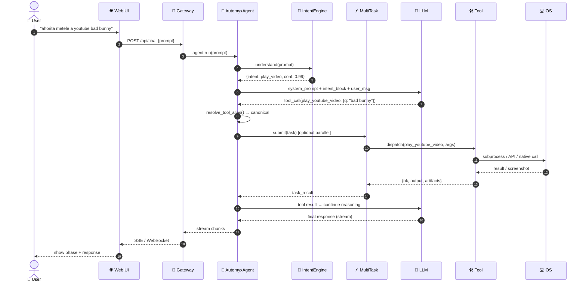

---

## 4. The Multi-Task Dispatcher

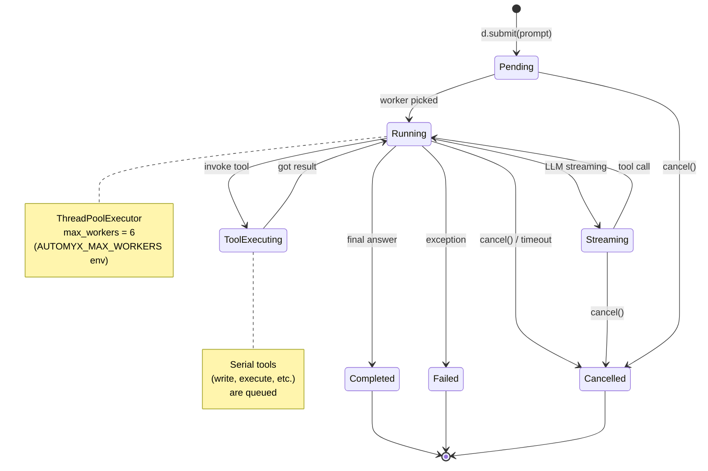

---

## 5. The Intent Engine (NLU)

```mermaid
flowchart LR
    IN[User text<br/>'ahorita guardame esto<br/>en el escritorio']
    IN --> N1{multi-word<br/>phrase?}
    N1 -->|yes| SN1[slang normalizer<br/>ahorita→ahora, metele→reproducir]
    N1 -->|no| N2[stem & fuzzy match]
    SN1 --> N2
    N2 --> N3[extract entities<br/>apps, folders, URLs, dates]
    N3 --> N4[match against<br/>30+ intent keywords]
    N4 --> N5[score & rank]
    N5 --> N6{confidence > 0.5?}
    N6 -->|yes| OUT1[resolved intent + entities]
    N6 -->|no| OUT2[unknown → LLM fallback]
    OUT1 --> INJ[inject into<br/>system prompt]
    INJ --> LLM[LLM with<br/>intent pre-context]
    OUT2 --> LLM

    style IN fill:#1a1a2e,color:#fff
    style OUT1 fill:#06ffa5,color:#000
    style OUT2 fill:#ffbe0b,color:#000
    style LLM fill:#8338ec,color:#fff
```

### Intent Categories (30+)

| Intent | Trigger keywords (ES) | Trigger (EN) | Target tool |
|---|---|---|---|
| `play_video` | metele, reproducir, ponme, youtube | play, watch, stream | `play_youtube_video` |
| `create_file` | crea, hazme, guardame, escribe | create, write, save | `write_file` |
| `open_program` | abre, lanzame, ejecutame | open, launch, run | `open_program` |
| `close_program` | cierra, mata, sal de | close, quit, kill | `close_window` |
| `web_search` | busca, google, averigua | search, google, find | `web_search` |
| `translate` | traduce, pasame a | translate, convert | `translate_text` |
| `screenshot_intent` | captura, screenshot, screenie | screenshot, snap | `screenshot` |
| `summarize` | resumen, sintetiza, TLDR | summarize, recap | `web_summarize` |
| `execute_cmd` | corre, ejecuta, terminal | run, exec, shell | `execute_cmd` |
| `type_text` | escribe, teclea, typea | type, enter text | `type_text` |
| `mouse_click` | click, presiona, dale | click, press, tap | `mouse_click` |
| ... 19 more | | | |

---

## 6. The Tool Alias Explosion (9,467 names)

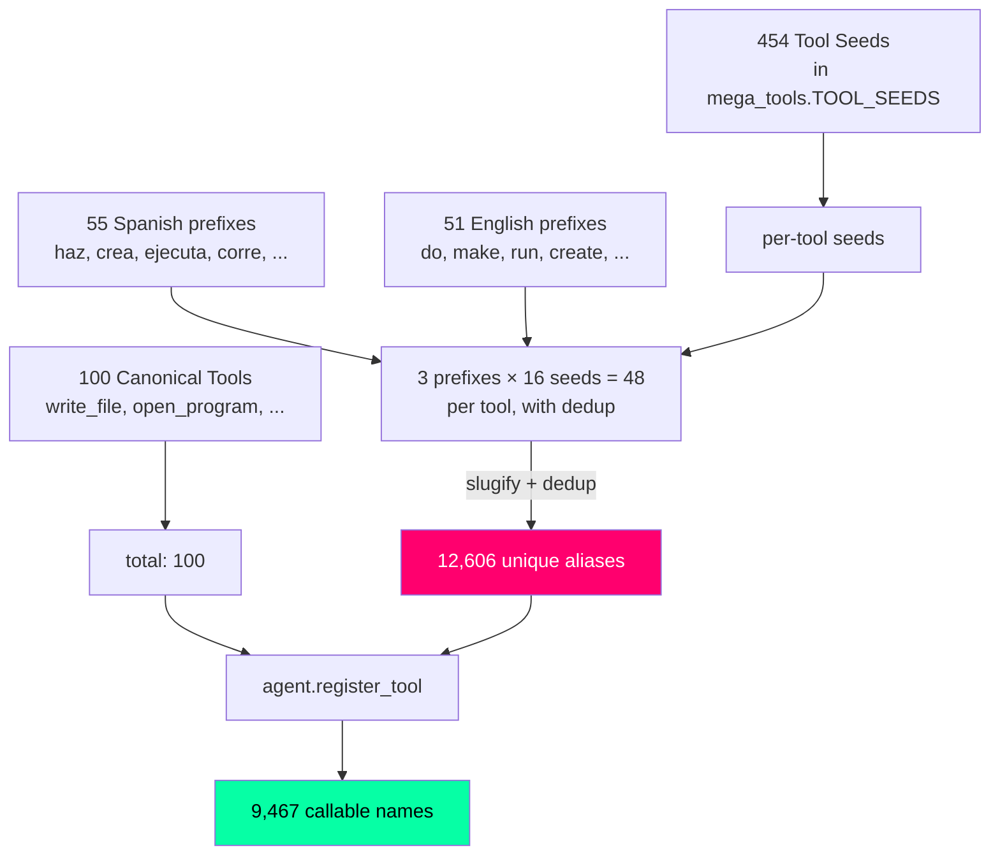

### Example: `write_file` aliases
```
guardar_archivo · crea_write_file · haz_write_file · do_write_file
ejecuta_write_file · make_write_file · run_write_file · save_write_file
... (60+ variations, all route to the same canonical tool)
```

---

## 7. The Memory Subsystem (AUMFORMBRING)

```mermaid
graph LR
    EVT[Agent Event<br/>tool_call, observation, error]
    EVT --> AUM[aumformbring.py<br/>extractor]
    AUM -->|classify| LEARN{novel<br/>pattern?}
    LEARN -->|yes| SAVE1[(learned_patterns.json)]
    LEARN -->|no| SKIP[skip]
    SAVE1 --> FORGE{can become<br/>a skill?}
    FORGE -->|yes| SKILL[skill_forger.py<br/>→ SKILL.md]
    FORGE -->|no| DONE
    SKILL --> REG[skill registry]
    EVT --> DB[(SQLite<br/>conversation_memory)]
    EVT --> VEC[(Vector store<br/>embeddings)]
    VEC --> SEARCH[semantic search]
    DB --> DECAY[temporal decay<br/>(recent > old)]
    DECAY --> CTX[context for next LLM call]

    style SKILL fill:#ffbe0b,color:#000
    style CTX fill:#3a86ff,color:#fff
```

---

## 8. Deployment Topology

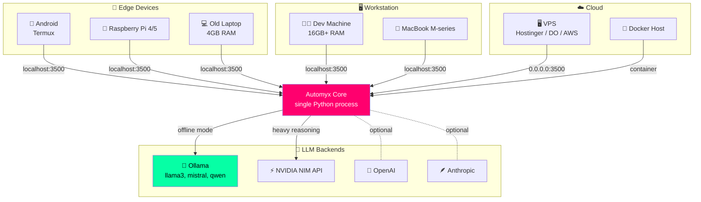

---

## 9. Data Flow (Streaming Chat)

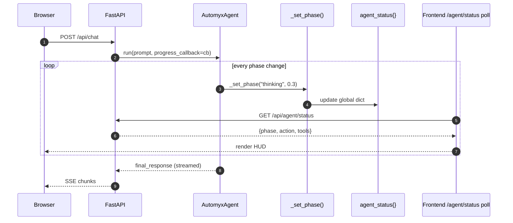

---

## 10. Module Dependency Graph

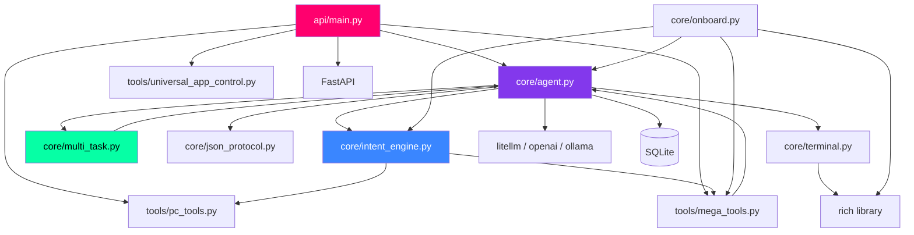

---

## 11. Skill Lifecycle

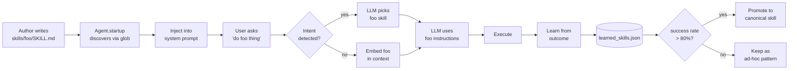

---

## 12. Error & Recovery Flow

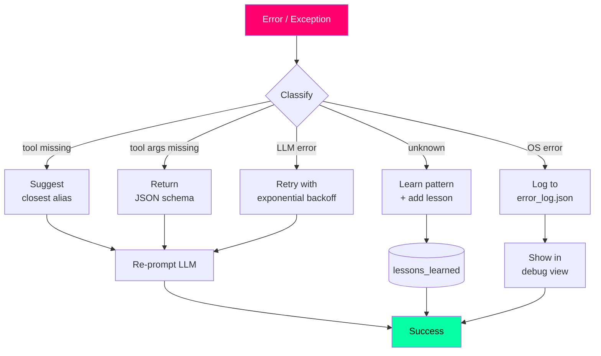

---

## 🔧 Engineering Principles

The full engineering contract lives in [Architecture.md](Architecture.md). Key rules:

1. **Core is agnostic** — `core/` doesn't know about specific tools. They register dynamically.
2. **SQLite is the only state** — no scattered JSONs for runtime state.
3. **One canonical path** — no shims, no fallbacks. Refactor > patch.
4. **Lean code** — no defensive branches for hypothetical cases.
5. **Zero polling in hot paths** — metadata is prepared at startup.
6. **In-line comments** — 1-3 lines explaining *why*, not *what*.
7. **CLI is a public API** — `automyx doctor`, `automyx start` are contracts.
8. **Skills are SKILL.md** — Just-in-Time context, not bloated Soul.md.
9. **Memory decays** — recent > old, prevent context bloat.
10. **Channels are transport** — WhatsApp/Telegram only move bytes.

---

## 📊 By the Numbers

| Layer | Files | LOC |
|---|---|---|
| `api/` | 1 | 1,800+ |
| `core/` | 13 | 8,500+ |
| `tools/` | 47 | 13,500+ |
| `skills/*/SKILL.md` | 86 | ~6,000 |
| `frontend/` | 10 | 4,864 |
| `*.md` (docs) | 115 | 8,998 |
| **Total project** | **~280** | **~46,000** |

---

<div align="center">

**Automyx 2.5 · Architecture · Last updated 2026**

[← Back to README](README.md)

</div>
