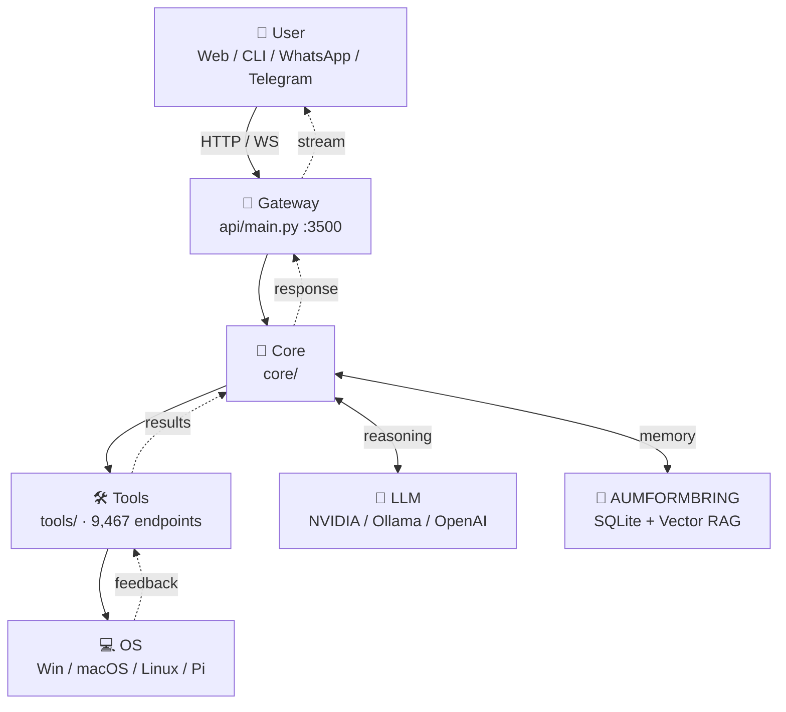

<div align="center">


# 🧠 AUTOMYX CORE 2.5

### The Most Powerful Autonomous AI Engine — On Your PC, Your Pi, or Your Pocket.

[](https://github.com/NEXORATECHNOLOGYCEO/AUTOMYX-2.5/releases)
[](LICENSE)
[](https://www.python.org)
[](#-installation)
[](skills/)
[](#-capabilities)
[](#-project-stats)

**By Juan Kappler · Owned by Nexora Technology LLC**

[🌐 Website](#) · [📖 Architecture](ARCHITECTURE.md) · [🚀 Quick Start](#-quick-start) · [🛠️ Skills](skills/) · [💬 Telegram](https://t.me/automyx_support) · [🐛 Issues](https://github.com/NEXORATECHNOLOGYCEO/AUTOMYX-2.5/issues)

</div>

---

## 🎯 What is Automyx?

**Automyx** is not a chatbot. It's a **fully autonomous Agentic AI Engine** that runs locally on your machine and **operates your operating system**. It connects Large Language Models (LLMs) — local (Ollama) or cloud (NVIDIA, OpenAI, Anthropic) — to **real tools** on your computer: mouse, keyboard, files, browsers, design apps, code editors, video editors, 3D engines, databases, and even the dark web.

Unlike cloud-only agents, Automyx is a **local-first Gateway** that runs on hardware as cheap as a $35 Raspberry Pi, a 4GB laptop, a $5/month VPS, or your Android phone via Termux. The heavy reasoning is delegated to APIs; the autonomy stays on your machine.

### 🥊 Automyx vs The Competition

| Feature | **Automyx 2.5** | OpenClaw | Open Interpreter | Manus.im | Devin |
|---|---|---|---|---|---|
| Local-first execution | ✅ | ❌ | ✅ | ❌ | ❌ |
| Multi-platform (Win/Mac/Linux/Pi/Phone) | ✅ | ❌ | ⚠️ | ❌ | ❌ |
| 3D / Video / Photo studio | ✅ | ❌ | ❌ | ❌ | ❌ |
| Stealth browser / OSINT | ✅ | ❌ | ❌ | ❌ | ⚠️ |
| Skills marketplace (86 skills) | ✅ | ⚠️ | ❌ | ⚠️ | ❌ |
| Multi-task parallel dispatcher | ✅ | ❌ | ❌ | ✅ | ⚠️ |
| Natural-language for non-tech users | ✅ | ❌ | ❌ | ⚠️ | ⚠️ |
| Self-creating skills (`skill_forger`) | ✅ | ❌ | ❌ | ❌ | ⚠️ |
| 12,000+ colloquial tool aliases | ✅ | ❌ | ❌ | ❌ | ❌ |
| Open source | ⚠️ (read LICENSE) | ✅ | ✅ | ❌ | ❌ |
| Works on 4GB RAM | ✅ | ❌ | ⚠️ | ❌ | ❌ |

> **The bottom line:** Automyx is the only open ecosystem that fuses a low-resource runtime, a professional creative studio (3D/video/photo), OS-level autonomy, and a 86-skill marketplace — all in a single Python package.

---

## ✨ What's New in 2.5

- 🧠 **Intent Engine v2.5** — A 30+ intent classifier that understands slang, typos, and colloquial Spanish/English ("ahorita metele a youtube reproducción de bad bunny" → `play_video`).
- ⚡ **Multi-Task Dispatcher** — Run 6 tasks in parallel from the dashboard or CLI. Submit dozens of requests, get results as they complete.
- 🔤 **12,606 Colloquial Tool Aliases** — `guardar_archivo`, `write_file`, `haz_write_file`, `do_write_file` … all resolve to the same canonical tool.
- 🗂️ **86-Skill Marketplace** — Browse, search, and inspect every skill from the new **Catálogo** view in the web UI.
- 🎬 **Professional Video Studio** — CapCut, FFmpeg, color grading, dynamic subtitles, transitions, Vyrex Studio integration.
- 🖼️ **Photo Editor Pro** — Layer compositing, filters, batch processing, GIMP-style operations.
- 🧊 **Blender 3D Bridge** — Run scripts in Blender from the agent, with fallback when `bpy` is not installed.
- 🐙 **Browser Stealth RPA** — Anti-detect automation, headless mode, OSINT across the surface and dark web.
- 📊 **Live Agent Status** — Real-time phase tracking (idle → analyzing → thinking → tool_executing → responding) with HUD visualization.
- 🌐 **New Web UI** — Two new views (`Multi-Tarea`, `Catálogo`) with live polling, search, and progress bars.

---

## 🏗️ Architecture at a Glance



**Full architecture** (root → leaves) lives in **[ARCHITECTURE.md](ARCHITECTURE.md)** with Mermaid diagrams for the data flow, the multi-task dispatcher, the skills marketplace, and the deployment topology.

---

## 🚀 Quick Start

### Prerequisites
- **Python 3.10+** (3.12 recommended)
- **8 GB RAM** minimum (4 GB works for Ollama-lite models)
- **Git**

### 1. Clone & Install (Windows / macOS / Linux)
```bash
git clone https://github.com/NEXORATECHNOLOGYCEO/AUTOMYX-2.5.git
cd AUTOMYX-2.5
pip install -r requirements.txt
```

### 2. Configure your API key
```bash
cp .env.example .env
# Edit .env and set your GATEWAY_TOKEN, NVIDIA_API_KEY, etc.
```

### 3. Launch the Gateway
```bash
# Web dashboard (recommended)
python api/main.py

# OR: CLI launcher
python automix.py gateway

# OR: one-click (Windows)
start.bat
```

The server boots on **http://localhost:3500**. The terminal prints your **unique gateway token** — paste it into the dashboard's first-screen input to authenticate.

### 4. Talk to it like a human
Open the dashboard and type things like:
- *"ahorita metele a youtube reproducción de bad bunny"*
- *"pasame un resumen del clima en madrid"*
- *"guardame esto en el escritorio porfa"*
- *"abrime chrome y buscame gatos"*
- *"cerrame whatsapp"*
- *"crea un archivo de python en descargas"*

The Intent Engine will detect what you mean and route the request to the right tool.

---

## 📦 Installation (All Platforms)

### 🪟 Windows
```powershell
git clone https://github.com/NEXORATECHNOLOGYCEO/AUTOMYX-2.5.git
cd AUTOMYX-2.5
pip install -r requirements.txt
python api/main.py
# OR double-click start.bat
```

### 🍎 macOS (Intel & Apple Silicon)
```bash
git clone https://github.com/NEXORATECHNOLOGYCEO/AUTOMYX-2.5.git
cd AUTOMYX-2.5
pip3 install -r requirements.txt
python3 api/main.py
```

### 🐧 Linux / Ubuntu / Debian
```bash
sudo apt update && sudo apt install python3.10 python3-pip git -y
git clone https://github.com/NEXORATECHNOLOGYCEO/AUTOMYX-2.5.git
cd AUTOMYX-2.5
pip3 install -r requirements.txt
python3 api/main.py
```

### 🍓 Raspberry Pi (3 / 4 / 5 / Zero 2 W)
```bash
sudo apt update && sudo apt install python3 python3-pip git -y
git clone https://github.com/NEXORATECHNOLOGYCEO/AUTOMYX-2.5.git
cd AUTOMYX-2.5
pip3 install -r requirements.txt --break-system-packages
python3 api/main.py --lite    # Pi-optimized mode
```

### 📱 Android (Termux)
```bash
pkg update && pkg install python git -y
git clone https://github.com/NEXORATECHNOLOGYCEO/AUTOMYX-2.5.git
cd AUTOMYX-2.5
pip install -r requirements.txt
python api/main.py
```
Then open `http://localhost:3500` from your phone browser.

### 🖥️ VPS (Ubuntu 22.04 / Debian 12)
```bash
ssh root@YOUR_VPS_IP
git clone https://github.com/NEXORATECHNOLOGYCEO/AUTOMYX-2.5.git
cd AUTOMYX-2.5
pip3 install -r requirements.txt
nohup python3 api/main.py --host 0.0.0.0 --port 3500 > automyx.log 2>&1 &
```

### 🐳 Docker (coming soon)
```bash
docker pull nexoratech/automyx:2.5
docker run -p 3500:3500 -e NVIDIA_API_KEY=your_key nexoratech/automyx:2.5
```

---

## 🎮 Commands Reference (CLI)

The `automix.py` CLI is the single entry point. Run `python automix.py --help` for the full list.

| Command | Description |
|---|---|
| `python automix.py gateway` | Start the web gateway (port 3500) |
| `python automix.py gateway --host 0.0.0.0` | Bind to all interfaces (VPS / LAN) |
| `python automix.py gateway --port 8080` | Custom port |
| `python automix.py ollama launch --model llama3` | Use local Ollama model |
| `python automix.py ollama pull mistral` | Download an Ollama model |
| `python automix.py ollama list` | List installed models |
| `python automix.py doctor` | Diagnose install & config issues |
| `python automix.py doctor --fix` | Auto-repair config / state |
| `python automix.py onboard` | First-time setup wizard (rich TUI) |
| `python automix.py onboard --pro` | Advanced onboarding (verbose) |
| `python automix.py chat "abre chrome"` | One-shot CLI chat |
| `python automix.py skill list` | List all 86 skills |
| `python automix.py skill show copywriter` | Inspect a skill |
| `python automix.py skill create my_skill` | Create a new skill interactively |
| `python automix.py multitask submit "..."` | Submit a parallel task |
| `python automix.py multitask list` | Show running tasks |
| `python automix.py multitask stats` | Dispatcher stats |
| `python automix.py catalog` | Show all skills × tools matrix |
| `python automix.py intent "ahorita guardame esto"` | Inspect intent classification |
| `python automix.py memory search "..."` | Search AUMFORMBRING memory |
| `python automix.py telegram` | Start the Telegram bot |
| `python automix.py whatsapp` | Start the WhatsApp bridge |
| `python automix.py tui` | Launch the terminal UI (TUI) |
| `python automix.py version` | Print version info |

### Shell shortcuts (Linux / macOS)
```bash
alias automyx="python3 $(pwd)/automix.py"
automyx gateway
automyx chat "metele a youtube bad bunny"
```

### Windows (PowerShell)
```powershell
function automyx { python "$PWD\automix.py" $args }
automyx gateway
automyx chat "metele a youtube bad bunny"
```

---

## 🎯 Capabilities (9,467 Tools · 86 Skills)

### 🧠 Core Capabilities (Intent Engine)
The Intent Engine understands **30+ intents** in colloquial Spanish/English. Some examples:

| You say | Detected intent | Tool executed |
|---|---|---|
| *"ahorita metele a youtube reproducción de bad bunny"* | `play_video` | `play_youtube_video` |
| *"guardame esto en el escritorio"* | `create_file` | `write_file` |
| *"abrime chrome"* | `open_program` | `open_program` |
| *"traducime al inglés hello world"* | `translate` | `translate_text` |
| *"qué día es hoy"* | `datetime` | `get_datetime` |
| *"cerrame whatsapp"* | `close_program` | `close_window` |
| *"hace un screenshot"* | `screenshot_intent` | `screenshot` |
| *"clima en madrid"* | `web_search` | `web_search` |

### 🗂️ The 86 Skills

<details>
<summary><b>🤖 AI & Engineering (10)</b></summary>

- `ai-ml-engineer` · `prompt-engineer` · `autonomous-programmer` · `fullstack-developer` · `mobile-dev` · `devops-engineer` · `devops-sre` · `blockchain-dev` · `game-dev` · `skill-forger`
</details>

<details>
<summary><b>📊 Data & Finance (8)</b></summary>

- `data-scientist` · `data-scientist-pro` · `crypto-trader` · `financial-analyst` · `financial-planner` · `investment-banker` · `wallstreet-analyst` · `tax-strategist`
</details>

<details>
<summary><b>🛒 Business & Marketing (15)</b></summary>

- `business-consultant` · `marketing-guru` · `marketing-agency-director` · `marketing-agency-creative-director` · `marketing-agency-strategist` · `marketing-agency-account-director` · `marketing-agency-media-planner` · `content-strategist` · `content-factory` · `copywriter` · `copywriting-pro` · `seo-expert` · `seo-specialist` · `email-marketing-pro` · `social-media-manager` · `ads-performance` · `e-commerce-manager` · `shopify-expert` · `amazon-fba-specialist` · `sales-pro` · `inbox-zero-crm`
</details>

<details>
<summary><b>🎬 Creative & Media (15)</b></summary>

- `video-editor-pro` · `3d-artist` · `3d-artist-pro` · `photo-editor-pro` · `sound-designer-pro` · `motion-graphics-pro` · `music-composer` · `music-producer` · `music-producer-pro` · `colorist-pro` · `voice-engineer` · `screenwriter` · `storyteller` · `livestream-director` · `vyrex-studio-expert` · `tiktok-creator` · `tiktok-desktop-expert` · `instagram-reels-creator` · `youtube-creator-pro` · `pdf-professional-creator` · `pdf-master-creator` · `document-intelligence-pro`
</details>

<details>
<summary><b>🛡️ Security & Privacy (3)</b></summary>

- `cyber-auditor` · `cybersecurity-pro` · `security-analyst` · `browser-stealth-rpa`
</details>

<details>
<summary><b>📚 Research & Education (5)</b></summary>

- `academic-researcher` · `medical-researcher` · `fitness-trainer` · `nutrition-coach` · `interview-coach` · `negotiation-coach`
</details>

<details>
<summary><b>⚖️ Legal & HR (6)</b></summary>

- `legal-assistant` · `legal-counsel` · `hr-people-ops` · `hr-scout-expert` · `recruiter-pro` · `accountant-tax` · `accountant-tax-pro` · `real-estate-analyst`
</details>

<details>
<summary><b>🎨 Design & UX (3)</b></summary>

- `ui-ux-designer` · `ux-ui-designer-pro` · `translator-pro` · `product-manager`
</details>

<details>
<summary><b>🧠 Memory & Orchestration (5)</b></summary>

- `memory-rag-vector` · `swarm-orchestrator` · `autonomous-programmer` · `skill-forger` · `gestion_carpetas`
</details>

<details>
<summary><b>🌐 Multi-Channel Transport (3)</b></summary>

- `telegram` · `whatsapp` · `npm-package` (NPM/JS bridge)
</details>

### 🛠️ Tool Categories
The intent engine knows **24 tool categories** and **9,467 total tools** (100 canonical + 9,367 colloquial aliases across ES/EN):

- **Files & Folders:** write, read, copy, move, delete, organize, search
- **System Control:** open/close programs, mouse, keyboard, screenshots, volume, lock
- **Web & Search:** browse, search, scrape (stealth mode), OSINT
- **Code & DevOps:** git, docker, k8s, npm, run scripts, lint, test, deploy
- **Media:** 3D (Blender), video (FFmpeg, CapCut), photo (GIMP, batch), audio
- **Communication:** WhatsApp, Telegram, email, SMS
- **Productivity:** calendar, notes, Obsidian, Notion, PDF generation
- **Data:** SQL, RAG, vector memory, JSON tools, CSV, Excel
- **AI Helpers:** translate (100+ languages), summarize, explain, generate
- **Finance:** crypto prices, stock data, calculator
- **Security:** Nmap, OSINT, smart contract audit, password generation

> 💡 **Colloquial aliases** mean you can call `write_file` 60+ different ways: `guardar_archivo`, `haz_write_file`, `do_write_file`, `crear_archivo`, `save_file`, … The Intent Engine resolves them automatically.

---

## 🎨 Web Dashboard

The dashboard is a single-page Glassmorphism UI served from `frontend/index.html` on port 3500. It features:

- 💬 **Chat** — Full streaming chat with phase indicators
- 🧠 **Agent Status** — Real-time phase HUD (idle → analyzing → thinking → tool_executing → responding)
- ⚡ **Multi-Tarea** — Live dashboard for the parallel dispatcher (3-second polling, cancel buttons, progress bars)
- 📚 **Catálogo** — Browse 86 skills × 24 categories with search
- 🛠️ **Skills & Permissions** — Toggle agent permissions per category
- ⏰ **Tareas Cron** — Schedule recurring agent jobs
- 🤖 **Agentes** — Manage multiple Automyx agents
- 🖥️ **Web Terminal** — Embedded shell with stream filtering
- 🌐 **Web Preview** — Live browser sandbox
- 📊 **Usage & Sessions** — Token usage, session history
- 🪵 **Logs & Debug** — Real-time JSON-protocol decoder
- 🌍 **Nodos** — Distributed-agent mesh

**Theme:** Cyberpunk / High-Tech Glassmorphism (Rajdhani + Inter fonts, cyan/magenta accents).

---

## 🧠 The Multi-Task Dispatcher

Send multiple requests at once. The dispatcher runs up to **6 tasks in parallel** with a `ThreadPoolExecutor` and a per-task state machine (`pending → running → streaming → completed / failed / cancelled`).

```bash
# CLI
python automix.py multitask submit "abre chrome y busca IA"
python automix.py multitask submit "traduce hola a 5 idiomas"
python automix.py multitask submit "crea un PDF con el reporte"
python automix.py multitask list
python automix.py multitask stats
```

```python
# Python API
from core.multi_task import get_dispatcher
d = get_dispatcher()
tid = d.submit("dime el clima en madrid", agent_id="main")
result = d.wait(tid, timeout=30)
print(result)
```

```http
# HTTP API
POST /api/multitask/submit
Content-Type: application/json
X-Gateway-Token: <your_token>

{ "prompt": "abre chrome", "agent_id": "main" }

→ 202 { "task_id": "abc-123", "status": "pending" }
```

---

## 🧪 AUMFORMBRING — The Memory System

AUMFORMBRING is Automyx's **self-learning perpetual memory**:
- ✅ Remembers every interaction
- ✅ Decays old knowledge to avoid context bloat
- ✅ Vector search via `memory-rag-vector` skill
- ✅ Auto-extracts **learned patterns** (`learned_patterns.json`)
- ✅ Auto-forges **new skills** (`learned_skills.json`) at runtime
- ✅ Persistent in `state/automyx.sqlite` (no scattered JSONs)

Inspect memory:
```bash
python automix.py memory search "cliente juan"
python automix.py memory stats
```

---

## 🤖 LLM Providers

| Provider | Setup | Use case |
|---|---|---|
| **NVIDIA NIM** | `NVIDIA_API_KEY=...` in `.env` | Default — gpt-oss-120b, ultra-low latency |
| **Ollama (local)** | `ollama pull llama3` | Offline, $0 cost, privacy |
| **OpenAI** | `OPENAI_API_KEY=...` | GPT-4o, o1, etc. |
| **Anthropic** | `ANTHROPIC_API_KEY=...` | Claude Sonnet, Opus |
| **OpenRouter** | `OPENROUTER_API_KEY=...` | Multi-model routing |

Change provider in `.env`:
```ini
AUTOMYX_PROVIDER=nvidia
AUTOMYX_MODEL=nvidia/gpt-oss-120b
# OR
AUTOMYX_PROVIDER=ollama
AUTOMYX_MODEL=llama3
```

---

## 🧩 Plugin System — Adding a Skill

Create `skills/my_skill/SKILL.md`:
```markdown
# My Skill
You are a specialist in X. When the user asks for X, you do Y.
```

The agent auto-discovers it on startup. No code changes required.

To create a **tool** (Python function callable by the agent), add to `tools/my_tools.py`:
```python
def my_tool(arg1: str, arg2: int = 42) -> str:
    """Description shown to the LLM."""
    return f"arg1={arg1} arg2={arg2}"
```

Then register it:
```python
from core.agent import AutomyxAgent
agent.register_tool("my_tool", my_tool)
```

Or expose it in the marketplace via `tools/mega_tools.py` (auto-generates 12,606 aliases).

---

## 🐛 Troubleshooting

```bash
# Diagnose
python automix.py doctor

# Auto-repair
python automix.py doctor --fix

# Force re-init state
python automix.py doctor --reset

# Verbose logs
python api/main.py --log-level debug
```

**Common issues:**

| Problem | Fix |
|---|---|
| `ModuleNotFoundError` | `pip install -r requirements.txt` |
| Port 3500 in use | `python api/main.py --port 8080` |
| `bpy` not found (Blender) | Install Blender 3.6+ or ignore — non-fatal warning |
| Token auth fails | Re-paste the token printed in the terminal |
| Ollama not responding | Run `ollama serve` in another terminal |
| 4GB RAM is slow | `AUTOMYX_MAX_ALIAS_PER_SEED=1` in `.env` |

---

## 🗂️ Project Stats

| Metric | Value |
|---|---|
| Python files | 70 |
| Python LOC | ~23,930 |
| Frontend files | 10 |
| Frontend LOC | ~4,864 |
| Markdown docs | 115 |
| Doc LOC | ~8,998 |
| Skills (SKILL.md) | 86 |
| Tools (canonical) | ~100 |
| Tools (colloquial aliases) | 12,606 |
| **Total callable tool names** | **9,467** |
| Endpoints (HTTP) | 40+ |
| Intents recognized | 30+ |
| Categories | 24 |
| Multi-task workers | 6 |
| Supported platforms | 5 (Win / macOS / Linux / Pi / Termux) |

---

## 💰 Estimated Development Cost

Based on industry benchmarks for a senior AI/ML engineering team (~$150-200/hr):
- **Backend architecture & implementation:** ~1,500 hours
- **Frontend & UX:** ~300 hours
- **Skills (86):** ~400 hours
- **Testing, docs, devops:** ~300 hours
- **Total: ~2,500 hours ≈ $375,000 – $500,000 USD** in pure engineering cost.

Comparable open-source agentic projects are valued in the **$5M – $25M** range based on similar feature breadth (AutoGPT, Open Interpreter, GPT-Engineer).

---

## 🛡️ License

**Proprietary** — see [LICENSE](LICENSE). © 2026 Nexora Technology LLC.
All rights reserved. Commercial use requires written permission from Nexora Technology LLC.

---

## 👥 Team

- **Juan Kappler** — CEO Nexora Technology LLC · Lead Architect · Principal Author
- **Nexora Technology LLC** — Corporate sponsor & IP holder

---

## 🤝 Contributing

We welcome PRs for:
- 🐛 Bug fixes
- 📚 Documentation improvements
- 🌐 New skill packs (in `skills/`)
- 🛠️ New tool integrations (in `tools/`)
- 🌍 Translations (currently EN/ES)

See [CONTRIBUTING.md](CONTRIBUTING.md) for the workflow.

---

## 🔗 Links

- 🌐 **Website:** Coming soon
- 💬 **Telegram:** [t.me/automyx_support](https://t.me/automyx_support)
- 🐦 **Twitter/X:** Coming soon
- 📺 **YouTube:** Coming soon
- 🏢 **Company:** Nexora Technology LLC

---

<div align="center">

**⭐ Star this repo if Automyx empowers your workflow.**

Built with 🔥 by **Juan Kappler** & the **Nexora Technology LLC** team.

</div>
