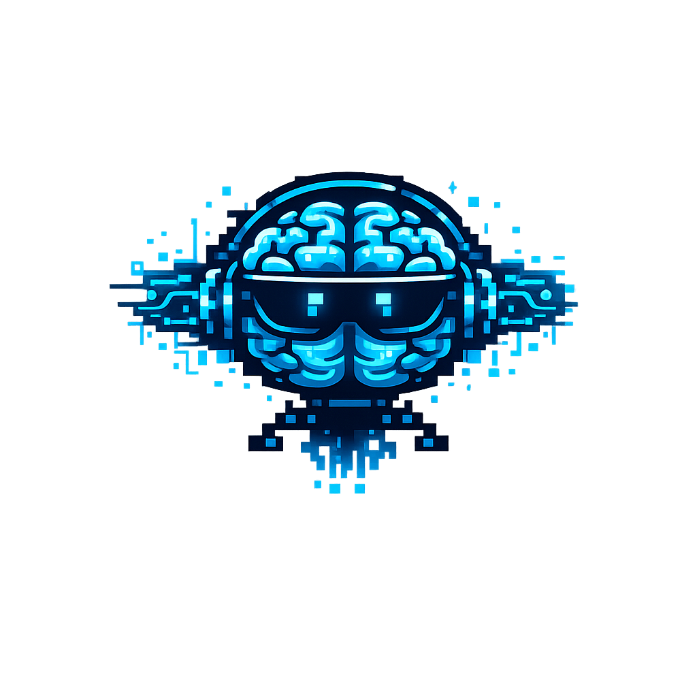
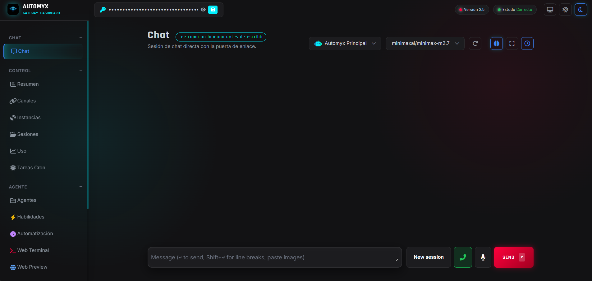

<div align="center">
  
  <h1>AUTOMYX CORE 2.5</h1>
  <p><strong>La Inteligencia Artificial autónoma más potente, optimizada para PCs de bajos recursos.</strong></p>
  <p>Desarrollado por <strong>Juan Kappler</strong> | Propiedad de <strong>Nexora Technology LLC</strong></p>
</div>

---

## 🚀 ¿Qué es Automyx?
**Automyx** no es un simple chatbot. Es un **Motor de Inteligencia Artificial Autónomo (Agentic AI)** diseñado para operar directamente sobre tu sistema operativo. A diferencia de soluciones basadas exclusivamente en la nube, Automyx se ejecuta como un *Gateway* local que conecta Modelos de Lenguaje de Gran Escala (LLMs) con herramientas reales de tu computadora.

### ⚡ La Evolución Definitiva: Automyx vs OpenClaw & Hermes
Automyx ha sido reescrito desde cero con una arquitectura modular y agresiva para aplastar a los gigantes de la automatización autónoma:
- **Superioridad sobre OpenClaw & HumanClaw:** OpenClaw depende de recursos pesados y su interacción con la interfaz gráfica (UI) es limitada. Automyx lo supera al incorporar un módulo de *Universal App Control* nativo, capaz de controlar aplicaciones de escritorio complejas (Blender, CapCut, VS Code) mediante macros e inyección de código, sumado a un razonamiento de latencia nula (Streaming Nativo).
- **Más allá de Hermes:** Mientras Hermes se basa en un contexto estático, Automyx incorpora el sistema *AUMFORMBRING* (Auto-aprendizaje y memoria perpetua), permitiendo al agente recordar, adaptar su comportamiento y crear sus propias habilidades (skills) sobre la marcha sin intervención del desarrollador.
- **La Ventaja Definitiva - Optimización Extrema:** A diferencia de NemoClaw u OpenClaw, Automyx está **hiper-optimizado para PCs de bajos recursos**. No necesitas una granja de GPUs de $10,000 USD. Su motor de enrutamiento dinámico delega la inferencia pesada a APIs de latencia ultra-baja (NVIDIA) o a modelos locales cuantizados, permitiendo que un laptop antiguo actúe como un desarrollador Senior, editor de video y hacker ético.

## 🛠️ Capacidades Élite (100+ Herramientas)
Automyx actúa como un equipo completo de profesionales:
1. **DevOps & Software Engineer:** Clona repositorios, resuelve conflictos de Git, detecta bugs, parchea código y despliega stacks de Docker/Kubernetes de manera 100% autónoma.
2. **Estudio de Producción 3D y Video:** Ejecuta scripts complejos en Blender para renders profesionales, y opera editores de video mediante FFmpeg para color grading, subtítulos dinámicos y transiciones.
3. **Ciberseguridad (Red Teaming):** Escaneos de red (Nmap), OSINT en la Dark Web, y auditorías de Smart Contracts (Solidity).
4. **Data Science Quantitativo:** Simulador de Jupyter en memoria para análisis predictivo y ejecución de consultas SQL en tiempo real.
5. **Control Absoluto del PC:** Abre aplicaciones (VS Code, Chrome, TikTok, Vyrex Studio), controla el mouse, escribe en el teclado y navega por la web de forma indetectable.

---

## 💻 Interfaz Gráfica: Elegancia y Profesionalismo Extremo

Automyx no solo es potente en su backend, sino que cuenta con un **Dashboard de Control de grado corporativo** diseñado con un estilo *Cyberpunk / High-Tech Glassmorphism*.

<div align="center">
  
</div>

### Características de la UI:
- **Limpia y Seria:** Olvídate de los chats convencionales. La interfaz está diseñada para desarrolladores y profesionales, sin distracciones y con tipografía técnica (`Rajdhani` y `Inter`).
- **Transparencia y Neón (Glassmorphism):** Paneles translúcidos que reflejan un fondo animado oscuro con sutiles destellos cyan y carmesí.
- **HUD de Ejecución en Vivo:** Mientras la IA procesa y ejecuta tareas en tu PC, despliega un **Terminal Holográfico 3D** en medio del chat. En lugar de bloques de código aburridos, verás una línea de tiempo estructurada que te explica paso a paso lo que el modelo está razonando y ejecutando, acompañado de LEDs parpadeantes de estado.
- **Libre de Ruido Visual:** El sistema intercepta automáticamente los JSONs técnicos que la IA utiliza para comunicarse con el sistema operativo, traduciéndolos en notificaciones de "Acción de Sistema" elegantes y ordenadas.

---

## 🌍 Arquitectura Multiplataforma y Bajo Consumo

Automyx ha sido diseñado desde su núcleo para ser **extremadamente eficiente y versátil**. A diferencia de otros agentes que requieren configuraciones de hardware exorbitantes (como GPUs dedicadas de gama alta o procesadores de última generación), Automyx cuenta con un motor ligero que puede ejecutarse prácticamente en cualquier dispositivo:

- **Hardware de Bajos Recursos:** Optimizado para funcionar de manera fluida en PCs antiguos o laptops con 4GB/8GB de memoria RAM. La carga pesada se enruta a través de la nube, mientras el control local consume menos del 2% del CPU.
- **Servidores VPS (Hostinger, AWS, DigitalOcean):** Automyx funciona a la perfección en modo "Headless" dentro de Servidores Privados Virtuales. Puedes tener a tu agente farmeando datos, haciendo trading o gestionando redes sociales 24/7 en la nube con sistemas operativos Ubuntu o Debian.
- **Ecosistema Apple (macOS):** Soporte nativo para MacBooks y Mac Mini, aprovechando la arquitectura Apple Silicon (M1/M2/M3) cuando se usan modelos locales.
- **Micro-ordenadores:** Soporte completo para **Raspberry Pi**, permitiéndote crear un clúster autónomo de IA de bajo costo y bajo consumo energético en tu propia casa.
- **Movilidad Total (Smartphones Android):** Sorprendentemente, el core de Automyx es capaz de ejecutarse directamente desde tu celular utilizando **Termux**. Puedes llevar todo el poder de este agente omnipotente literalmente en tu bolsillo y controlarlo vía Web.

---

## ⚙️ Instalación y Despliegue Rápido

Poner a funcionar Automyx es un proceso directo. Asegúrate de tener Python 3.10+ instalado.

1. **Clona el repositorio:**
   ```bash
   git clone https://github.com/NEXORATECHNOLOGYCEO/AUTOMYX-2.5.git
   cd AUTOMYX-2.5
   ```

2. **Instala las dependencias:**
   ```bash
   pip install -r requirements.txt
   ```

3. **Inicia el Motor y el Gateway (Servidor):**
   ```bash
   python api/main.py
   ```
   *(También puedes usar el CLI integrado: `python automix.py gateway`)*

4. **Accede al Dashboard:**
   Una vez iniciado, abre tu navegador y entra a `http://localhost:3500`. La terminal te generará y mostrará el **Token de seguridad único** necesario para ingresar y controlar a la IA.

---

## 🧠 Modelos Locales y Ollama (Offline Mode)
Aunque Automyx puede usar APIs ultra-rápidas (Nvidia/OpenAI/MiniMax), también **soporta modelos locales al 100%** para privacidad absoluta sin necesidad de internet:
1. Asegúrate de tener instalado [Ollama](https://ollama.com).
2. En la terminal de Automyx, descarga un modelo compatible: `automix ollama pull llama3` o `automix ollama pull mistral`.
3. Inicia Automyx apuntando al modelo local: `automix ollama launch --model llama3 --location local`.

---

## 🏢 Sobre Nexora Technology LLC y Colaboradores
Este proyecto es impulsado por la visión corporativa de **Nexora Technology LLC**, bajo el liderazgo y desarrollo arquitectónico de **Juan Kappler**. Nuestro objetivo es democratizar la Inteligencia Artificial de grado militar, permitiendo que cualquier individuo u organización pueda tener un agente omnipotente a su servicio.

**Equipo y Creadores:**
- **Juan Kappler:** CEO de Nexora Technology LLC, Lead Architect & Creador Principal.

---
*© 2026 Nexora Technology LLC. Todos los derechos reservados.*