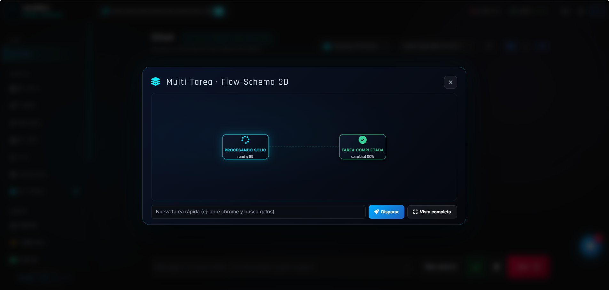
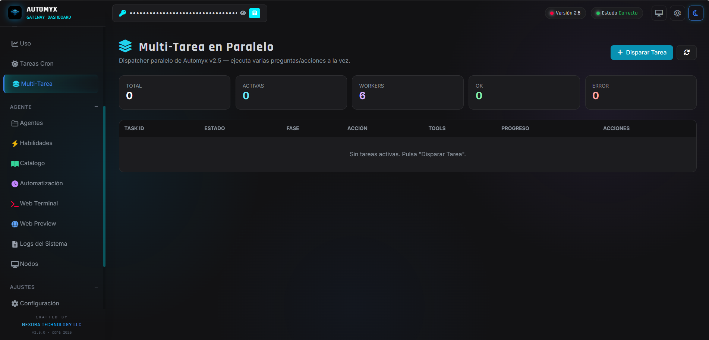
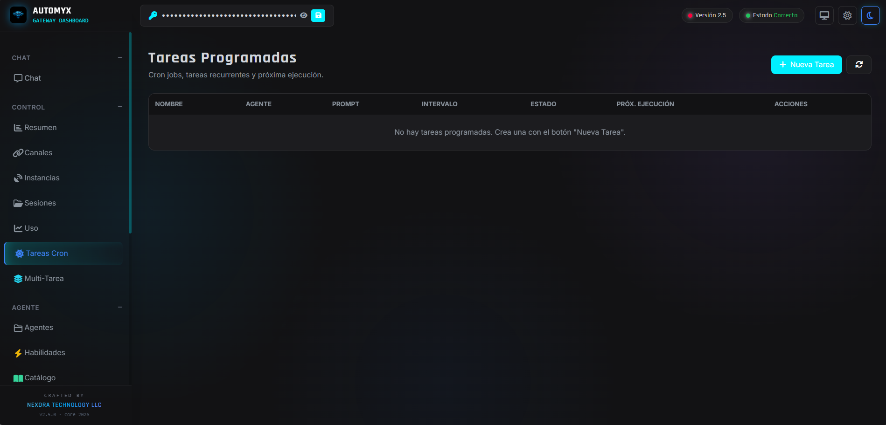
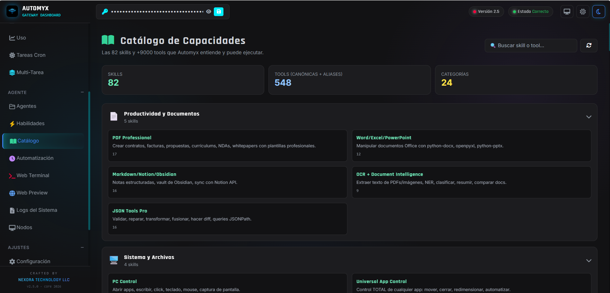

# Automyx UI Screenshots

## 1. Multitarea — Vista general

Vista general de la sección **Multitarea**. Muestra la interfaz principal donde se pueden ver y gestionar múltiples tareas ejecutándose simultáneamente.

## 2. Multitarea — Dos procesos simultáneos

Dos procesos ejecutándose **al mismo tiempo** en la interfaz multitarea. Se accede desde el chat con el botón azul. Muestra cómo el sistema maneja requests concurrentes sin bloquearse.

## 3. Multitarea — Ejecución en paralelo

Sección de **multitarea en paralelo**. Permite ejecutar herramientas sin dependencia entre sí de forma simultánea, acelerando flujos de trabajo complejos.

## 4. Tareas programadas

Sección de **tareas programadas** (scheduled tasks). Interfaz para programar ejecuciones automáticas en el tiempo.

## 5. Chat

Sección de **chat** de la interfaz principal. Punto de entrada para comunicarse con el agente Automyx en lenguaje natural.

## 6. Catálogo de habilidades

**Catálogo de habilidades** (skills catalog). Muestra las herramientas y capacidades disponibles que el agente puede ejecutar.
